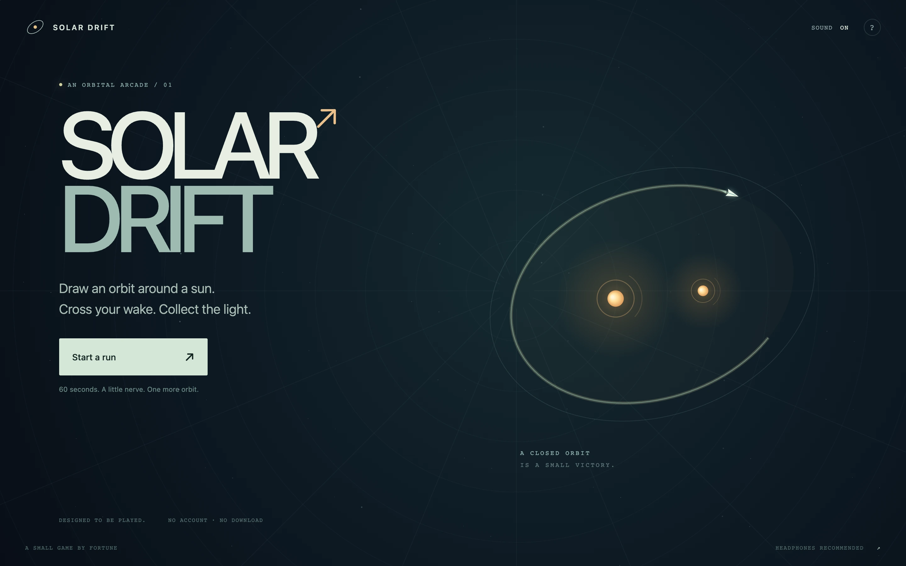
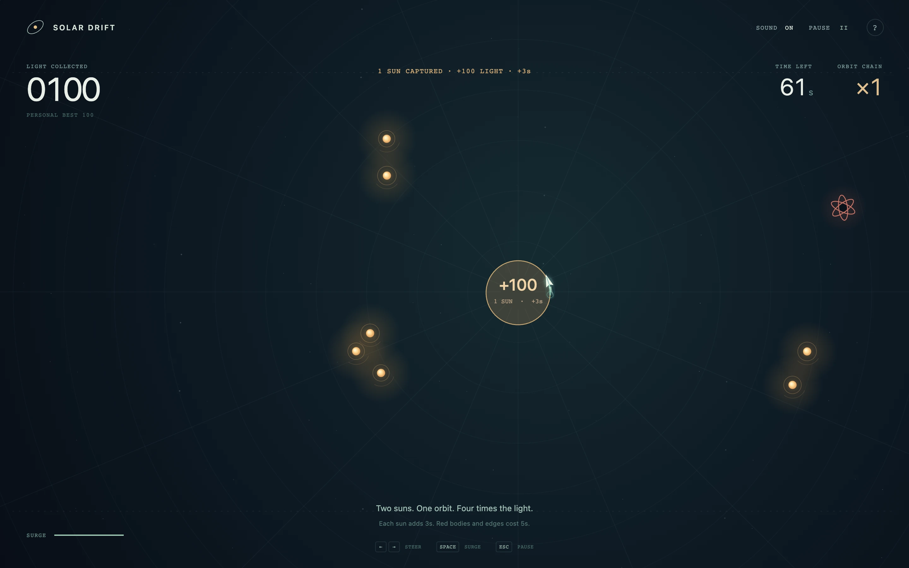

# Solar Drift

**Draw an orbit. Cross your wake. Collect the light.**

**[Play in the browser](https://fortunexbt.github.io/solar-drift/)**



A small orbital arcade game about making a good circle under pressure. Steer a ship around glowing suns, cross the trail you leave behind, and collect everything inside the loop. Bigger catches buy more time—and bring more hazards into your path.

Canvas 2D · TypeScript · Procedural WebAudio · No account or backend

## Your first orbit

Choose **Start a run** to enter the flight area. The ship and clock wait for your first steering input. Hold **←** or the left touch button to curve around the marked sun, then meet your own wake.



Once launched, you always move forward. Your wake lasts **7 seconds**: cross an older part of it to close a loop and capture the suns inside. Surge makes you faster and your turning circle wider.

| What happens | What changes |
| --- | --- |
| Begin a flight | **60 seconds** on the clock |
| Enclose suns in a loop | Collect light and **+3 seconds per sun**, up to 90 seconds remaining |
| Capture again within 9 seconds | Grow the scoring chain, up to **×4** |
| Close an empty orbit | Clear the loop and reset the chain |
| Hit a red body or the edge | Lose **5 seconds**, your wake, and your chain |
| Pass close to a red body | Recharge your surge |
| Keep collecting | More red bodies enter the arena, up to **six** |

Light per capture is **100 × suns² × chain multiplier**. At ×1, one sun earns 100, two together earn 400, and three together earn 900. The reward is for enclosing them in the **same loop**.

## Controls

| Action | Keyboard | Pointer / touch |
| --- | --- | --- |
| Steer | **← / →** or **A / D** | Hold and drag on the flight area to aim; use **↶ / ↷** on mobile |
| Surge | Hold **Space**, **Shift**, **↑**, or **W** | Hold **Surge** |
| Pause / resume | **Escape** | **Pause**, then **Resume flight** |
| Toggle sound | **M** | **Sound** |
| Read the guide | Tab to **?**, then Enter | Tap **?** |

Sound begins only after a user interaction. Headphones suit the quiet motion bed and glass-like capture notes.

## Run locally

Use **Node.js 20.19 or newer**.

```bash
npm ci
npm run dev
```

Open the local URL printed by Vite. To check a change:

```bash
npm run check
```

This runs TypeScript checking, the Vitest suite, and a production build. The suite covers orbital geometry and gameplay rules.

| Command | Purpose |
| --- | --- |
| `npm run typecheck` | Check TypeScript without emitting files |
| `npm test` | Run the test suite once |
| `npm run test:watch` | Run tests while developing |
| `npm run build` | Build the static site into `dist/` |
| `npm run preview` | Serve the production build locally |

## Inside the game

| Source | Responsibility |
| --- | --- |
| [`src/main.ts`](./src/main.ts) | Entry point for the orbital game |
| [`src/orbit/main.ts`](./src/orbit/main.ts) | Flight lifecycle, input, UI updates, sound events, and local preferences |
| [`src/orbit/physics.ts`](./src/orbit/physics.ts) | Movement, wake closure, polygon capture, scoring, charge, and hazards |
| [`src/orbit/render.ts`](./src/orbit/render.ts) | Canvas drawing for the observatory, ship, suns, trails, and captured orbits |
| [`src/orbit/audio.ts`](./src/orbit/audio.ts) | Synthesized motion bed and bounded, tuned sound effects |
| [`src/orbit/style.css`](./src/orbit/style.css) · [`index.html`](./index.html) | Responsive interface, controls, guide, and run summaries |
| [`src/orbit/physics.test.ts`](./src/orbit/physics.test.ts) | Geometry and gameplay checks |

The runtime lives in `src/orbit/`.

## Data, sound, and credits

The game runs in the browser. It has no account system, analytics, server-side score storage, external font dependency, or runtime service to contact. Browser storage is optional; a run still works when storage is unavailable.

| Local storage key | Saved value |
| --- | --- |
| `solarDriftOrbitBest` | Best orbital-game score on this browser |
| `solarDriftOrbitSound` | Sound preference |

Clearing this site's browser data removes its saved scores and preferences; nothing syncs across devices.

Made by **Fortune**. The game visuals are drawn procedurally, and the audio is synthesized with the Web Audio API. No third-party recordings, samples, or font files are bundled for the orbital game.

Code and original assets are available under the [MIT License](./LICENSE).
