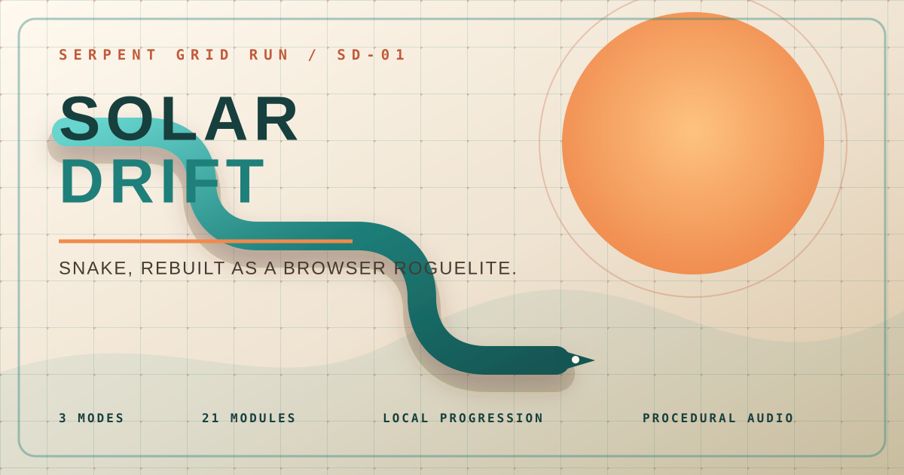
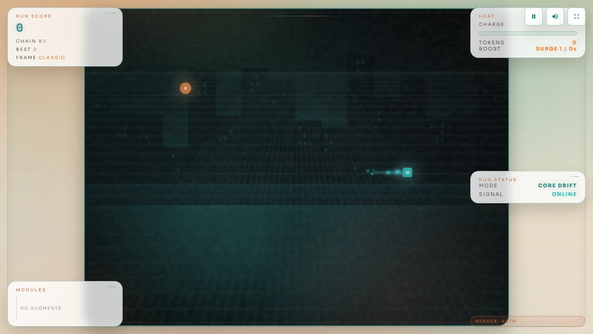

# Solar Drift



Solar Drift rebuilds Snake as a warm retro-futurist roguelite. Trace clean lines through a live hazard grid, turn near misses into heat, and choose a new module whenever the run advances a stage.

It is a deliberately compact browser game: no account, no backend, no multiplayer, and no paid content. Progress, upgrades, frames, daily targets, and leaderboards stay in `localStorage` on the current device.

## On the grid



## What is in the machine

- Three distinct run profiles: **Core Drift**, **Rush Loop**, and **Gate Run**.
- 21 stackable run modules spanning scoring, movement, pickups, recovery, hazards, and overdrive.
- Seven permanent workshop upgrades purchased with tokens earned on the grid.
- Five unlockable visual frames with their own palettes.
- A date-seeded daily target and score-sorted local leaderboard.
- Near-miss heat, boost, combo chains, power-ups, stage choices, hazards, and revive states.
- Adaptive visual quality, canvas rendering, particles, post-processing, and spatial cues.
- A runtime-synthesized WebAudio score and sound effects—no bundled recordings or samples.
- Keyboard, swipe, and coarse-pointer controls, with a first-run flight manual and live status announcements.

## Controls

| Action | Keyboard | Touch |
| --- | --- | --- |
| Steer | Arrow keys or `W` `A` `S` `D` | Swipe the grid or use the direction pad |
| Boost | `Shift`, `E`, or `B` | **Boost** button |
| Pause / resume | `Space` or `Escape` | Pause button |
| Choose a module | `1`–`3`, arrows, then `Enter` or `Space` | Tap a module |
| Toggle sound | `M` or the speaker button | Speaker button |
| Toggle FPS readout | `F` | — |

## Run it locally

Solar Drift requires Node.js 20.19 or newer.

```bash
npm ci
npm run dev
```

Open the local URL printed by Vite. Before sending a change, run the same complete check used in CI:

```bash
npm run check
```

That command type-checks the TypeScript, runs the deterministic unit suite, and creates the production bundle.

## Architecture

| Area | Source | Responsibility |
| --- | --- | --- |
| Runtime | `src/game.ts` | Run lifecycle, progression, collision rules, scoring, pause state, and screen orchestration |
| Entities | `src/entities/` | Snake, food, power-ups, and hazards |
| Rendering | `src/render.ts`, `src/particles.ts` | Canvas drawing, glow/post effects, backdrop, and particles |
| Input | `src/input/InputManager.ts` | Keyboard, pointer, touch-pad, and swipe normalization |
| Sound | `src/audio.ts` | Procedural music voices, effects, ducking, and spatial WebAudio cues |
| Meta layer | `src/meta.ts` | Local progression, upgrades, daily target, leaderboard ordering, and run-summary codes |
| Configuration | `src/config.ts` | Modes, frames, upgrades, modules, tuning, and quality tiers |
| Interface | `index.html`, `src/ui.ts` | Responsive screens, semantic controls, HUD, onboarding, and announcements |

The production build uses a relative Vite base, so the generated `dist/` works from a GitHub project Pages path as well as a local static server.

## Data and privacy

Solar Drift makes no network request for gameplay data. It stores its meta state under the `neonSnakeMeta` key and its first-run guide state under `solarDriftGuideSeen` in browser `localStorage`. Clearing site data resets that device's progress. The only optional network request is the stylesheet import for Google Fonts; the game falls back to local sans-serif and monospace families if it is unavailable.

## Audio provenance

The project intentionally ships no third-party music, recordings, or samples. Its score and effects are generated at runtime with the Web Audio API from oscillators, filtered noise, envelopes, delay, and panning. This keeps the repository reproducible and the asset rights unambiguous.

## Deploying to GitHub Pages

The Pages workflow builds and verifies every push to `main`, uploads `dist/`, and deploys it through GitHub's official Pages actions. In the repository settings, select **GitHub Actions** as the Pages source; no committed build folder is required.

Pull requests and pushes to `main` also run the independent test workflow. See [CONTRIBUTING.md](./CONTRIBUTING.md) for the development contract.

## License

Solar Drift is released under the [MIT License](./LICENSE).
